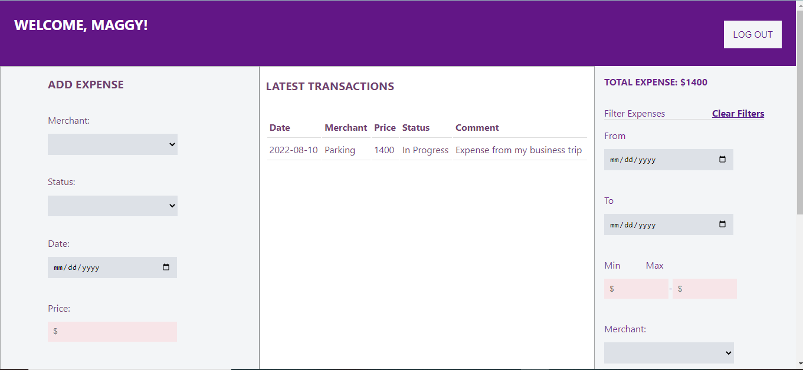

# Expense Tracker

This project was bootstrapped with [Create React App](https://github.com/facebook/create-react-app).

## Table of contents

- [Overview](#overview)
  - [Screenshot](#screenshot)
  - [Links](#links)
  - [Built with](#built-with)
  - [What I learned](#what-i-learned)
  - [Useful resources](#useful-resources)
- [Author](#author)

## Overview
This is a web app that performs the function of an expense tracker. It has the following features:
- A create Employee Profile Page that uses the following details: Name, Profile Picture, Job description, Location, and Department.

- Picture upload functionality to upload employee picture

- Receipt Upload functionality to attach receipt
### Screenshot

### Links

- Solution URL: [https://github.com/PrincessMaggy/expense-tracker.git]
- Live Site URL: [https://princessmaggy.github.io/expense-tracker]

### Built with

- Semantic HTML5 markup
- CSS custom properties
- Sass
- React
- Google Firebase

### What I learned
- I got better understanding of how to use state and class components in react.

- This would be my first time using google firebase for some backend stuff and it was litttt!

### Useful resources
[https://stackoverflow.com/questions/70445014/module-not-found-error-package-path-is-not-exported-from-package]

[https://github.com/firebase/quickstart-js/issues/239]
## Author

- Website - [Maggy](https://princessmaggy.github.io/My-Portfolio/)
- Frontend Mentor - [@Maggy](https://www.frontendmentor.io/profile/princessmaggy)
- Twitter - [@princessMaggy7](https://www.twitter.com/princessMaggy7)

